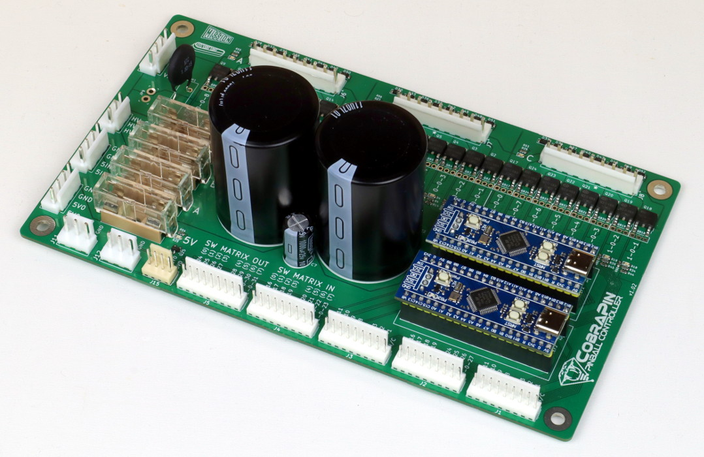
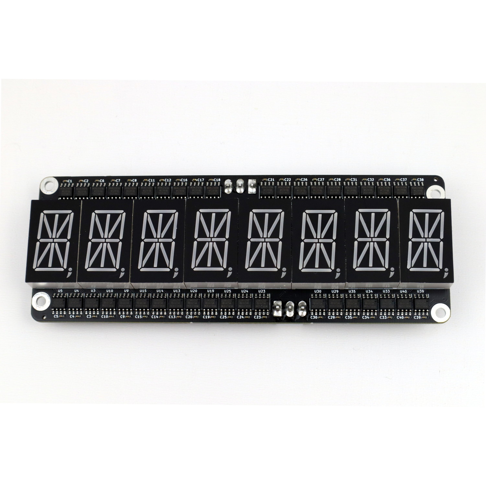
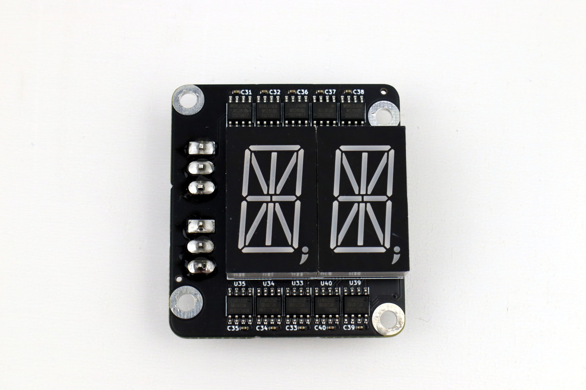

*****
Boards
*****

CobraPin Main Board
=====

**Features:**
* **24 coil drivers** for solenoids, flashers, motors, etc. Outputs are broken out into 3 banks of 8 outputs.
* **38 direct switch inputs** <OR> **22 direct inputs** and an **8x8 switch matrix**
* **Neopixel support** for 512 RGB or RGBW LEDs
* **12-50V power filter**. Board also provides the common ground for the supplies.
* **Fuses''' for solenoid banks and Neopixels
* **Relay Control Output** for common dual relay boards
* Easy replacement of at-risk components
    *Processor boards are socketed
    *Transistors can be removed with simple soldering tools and replaced with through-hole components
    *Fuse clips for common 5x20mm fuses

Xpansion Board
=====

Satellite Board
=====

SweetLED Board
=====

LED Boards
=====
Pop/Dome RGBW LED Ring
-----

Minidome RGB LED Ring
-----

Insert/GI RGBW LED Stick
-----

Connector Boards
=====
Branch Board
-----

Twig Board
-----

Serial LED Strip Connector
-----

NeoSeg Segment Displays
=====
8-Digit
-----

2-Digit
-----
